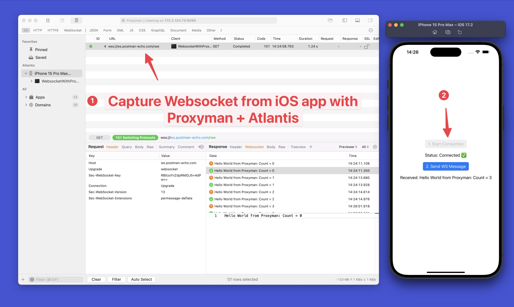

[](https://cocoapods.org/pods/atlantis-proxyman)
[](https://cocoapods.org/pods/atlantis-proxyman)
[](https://twitter.com/proxyman_app)
[](https://gitter.im/Proxyman-app/community?utm_source=badge&utm_medium=badge&utm_campaign=pr-badge&utm_content=badge)
[](https://cocoapods.org/pods/atlantis-proxyman)

## Features
- [x] ✅ **Automatically** intercept all YOUR HTTP/HTTPS Traffic with 1 click
- [x] ✅ **No Proxy or trust any Certificates**
- [x] ✅ Capture WS/WSS Traffic from URLSessionWebSocketTask
- [x] Capture gRPC traffic (Advanced)
- [x] Support iOS Physical Devices and Simulators
- [x] Review traffic log from macOS [Proxyman](https://proxyman.io) app ([Github](https://github.com/ProxymanApp/Proxyman))
- [x] Categorize the log by project and devices.
- [x] Ready for Production


## ⚠️ Note
- Atlantis is built for debugging purposes. All debugging tools (such as Map Local, Breakpoint, and Scripting) don't work.
- If you want to use debugging tools, please use normal Proxy.

## Requirement
- macOS Proxyman app
- iOS 16.0+ / macOS 11+ / Mac Catalyst 13.0+
- Xcode 14+
- Swift 5.0+

## 👉 How to use
### 1. Install Atlantis framework
### Swift Packages Manager (Recommended)
- Add `https://github.com/ProxymanApp/atlantis` to your project

### CocoaPod
- Add the following line to your Podfile
```bash 
pod 'atlantis-proxyman'
```

### 2. Add Required Configuration to `Info.plist` (iOS 14 or later)
1. Open your iOS Project -> Open the `Info.plist` file and add the following keys and values:

```xml
<key>NSLocalNetworkUsageDescription</key>
<string>Atlantis would use Bonjour Service to discover Proxyman app from your local network.</string>
<key>NSBonjourServices</key>
<array>
    <string>_Proxyman._tcp</string>
</array>
```

- [Info.plist Example](https://github.com/ProxymanApp/atlantis/blob/main/Example/Atlantis-Example-App/Atlantis-Example-App/Info.plist)
- Reason: Atlantis uses Bonjour Service to transfer the data on your iPhone -> Proxyman macOS. It runs locally on your local network.


### 3. Start debugging

1. If you have only **ONE** macOS machine that opened Proxyman. Let's use the simple version:

- Open file `AppDelegate.swift`

```swift
#if DEBUG
import Atlantis
#endif

func application(_ application: UIApplication, didFinishLaunchingWithOptions launchOptions: [UIApplication.LaunchOptionsKey: Any]?) -> Bool {

    // Auto connect to a current Macbook
    // Add to the end of `application(_:didFinishLaunchingWithOptions:)` in AppDelegate.swift or SceneDelegate.swift
    #if DEBUG
        Atlantis.start()
    #endif

    return true
}
```

- If there are many Proxyman apps from colleagues' Mac Machines, and you would Atlantis connects to your macOS machine. Let use `Atlantis.start(hostName:)` version

```swift
#if DEBUG
import Atlantis
#endif

func application(_ application: UIApplication, didFinishLaunchingWithOptions launchOptions: [UIApplication.LaunchOptionsKey: Any]?) -> Bool {

    // Auto connect to a current Macbook
    // Add to the end of `application(_:didFinishLaunchingWithOptions:)` in AppDelegate.swift or SceneDelegate.swift
    #if DEBUG
        Atlantis.start(hostName: "Your_host_name")
    #endif

    return true
}
```

You can get the `hostName`: Open Proxyman macOS -> Certificate menu -> Install for iOS -> Atlantis -> How to Start Atlantis -> and copy the `HostName`


- If your project uses Objective-C, please use **CocoaPod** to install Atlantis (Install via SPM might not work).

```objective-c
#import "Atlantis-Swift.h"

// Or import Atlantis as a module, you can use:
@import Atlantis;

// Add to the end of `application(_:didFinishLaunchingWithOptions:)` in AppDelegate
[Atlantis startWithHostName:nil];
```

2. Make sure your iOS devices/simulator and macOS Proxyman are in the **same Wi-Fi network** or connect your iOS Devices to your Mac by a **USB cable**
3. Start your iOS app via Xcode. Works with iOS Simulator or iOS Devices.
4. Proxyman now captures all HTTP/HTTPS, Websocket from your iOS app
5. Enjoy debugging ❤️

## Websocket Traffic
- By using Atlantis, Proxyman can capture Websocket from `URLSessionWebsocketTask` from iOS out of the box.
- If your app uses 3rd-party Websocket libraries (e.g. Starscream), Atlantis doesn't work because Starscream doesn't use `URLSessionWebsocketTask` under hood.
- Example app: https://github.com/NghiaTranUIT/WebsocketWithProxyman



## Example App
Atlantis provides a simple iOS app that can demonstrate how to integrate and use Atlantis and Proxyman. Please follow the following steps:
1. Open Proxyman for macOS
2. Open iOS Project at `./Example/Atlantis-Example-App.xcodeproj`
3. Start the project with any iPhone/iPad Simulator
4. Click on buttons on the main screen
5. Back to Proxyman app and inspect your HTTPS Request/Response.


<details>
  <summary>Advanced Usage</summary>

By default, if your iOS app uses Apple's Networking classes (e.g. URLSession) or using popular Networking libraries (e.g. Alamofire and AFNetworking) to make an HTTP Request, Atlantis will work **OUT OF THE BOX**.

However, if your app doesn't use any one of them, Atlantis is not able to automatically capture the network traffic. 

To resolve it, Atlantis offers certain functions to help you **manually*** add your Request and Response that will present on the Proxyman app as usual.

#### 1. My app uses C++ Network library and doesn't use URLSession, NSURLSession, or any iOS Networking library
You can construct the Request and Response for Atlantis from the following func
```swift
    /// Handy func to manually add Atlantis' Request & Response, then sending to Proxyman for inspecting
    /// It's useful if your Request & Response are not URLRequest and URLResponse
    /// - Parameters:
    ///   - request: Atlantis' request model
    ///   - response: Atlantis' response model
    ///   - responseBody: The body data of the response
    public class func add(request: Request,
                          response: Response,
                          responseBody: Data?) {
```
- Example:
```swift
@IBAction func getManualBtnOnClick(_ sender: Any) {
    // Init Request and Response
    let header = Header(key: "X-Data", value: "Atlantis")
    let jsonType = Header(key: "Content-Type", value: "application/json")
    let jsonObj: [String: Any] = ["country": "Singapore"]
    let data = try! JSONSerialization.data(withJSONObject: jsonObj, options: [])
    let request = Request(url: "https://proxyman.io/get/data", method: "GET", headers: [header, jsonType], body: data)
    let response = Response(statusCode: 200, headers: [Header(key: "X-Response", value: "Internal Error server"), jsonType])
    let responseObj: [String: Any] = ["error_response": "Not FOund"]
    let responseData = try! JSONSerialization.data(withJSONObject: responseObj, options: [])
    
    // Add to Atlantis and show it on Proxyman app
    Atlantis.add(request: request, response: response, responseBody: responseData)
}
```

#### 2. My app uses GRPC
You can construct the unary Request and Response from GRPC models via the interceptor pattern that is provided by
grpc-swift and leverage this to get a complete log of your calls. 


<details><summary>Here is an example for an AtlantisInterceptor</summary>

```swift
        import Atlantis
        import Foundation
        import GRPC
        import NIO
        import NIOHPACK
        import SwiftProtobuf

        extension HPACKHeaders {
            var atlantisHeaders: [Header] { map { Header(key: $0.name, value: $0.value) } }
        }

        public class AtlantisInterceptor<Request: Message, Response: Message>: ClientInterceptor<Request, Response> {
            private struct LogEntry {
                let id = UUID()
                var path: String = ""
                var started: Date?
                var request: LogRequest = .init()
                var response: LogResponse = .init()
            }

            private struct LogRequest {
                var metadata: [Header] = []
                var messages: [String] = []
                var ended = false
            }

            private struct LogResponse {
                var metadata: [Header] = []
                var messages: [String] = []
                var end: (status: GRPCStatus, metadata: String)?
            }

            private var logEntry = LogEntry()

            override public func send(_ part: GRPCClientRequestPart<Request>,
                                      promise: EventLoopPromise<Void>?,
                                      context: ClientInterceptorContext<Request, Response>)
            {
                logEntry.path = context.path
                if logEntry.started == nil {
                    logEntry.started = Date()
                }
                switch context.type {
                case .clientStreaming, .serverStreaming, .bidirectionalStreaming:
                    streamingSend(part, type: context.type)
                case .unary:
                    unarySend(part)
                }
                super.send(part, promise: promise, context: context)
            }

            private func streamingSend(_ part: GRPCClientRequestPart<Request>, type: GRPCCallType) {
                switch part {
                case .metadata(let metadata):
                    logEntry.request.metadata = metadata.atlantisHeaders
                case .message(let messageRequest, _):
                    Atlantis.addGRPCStreaming(id: logEntry.id,
                                              path: logEntry.path,
                                              message: .data((try? messageRequest.jsonUTF8Data()) ?? Data()),
                                              success: true,
                                              statusCode: 0,
                                              statusMessage: nil,
                                              streamingType: type.streamingType,
                                              type: .send,
                                              startedAt: logEntry.started,
                                              endedAt: Date(),
                                              HPACKHeadersRequest: logEntry.request.metadata,
                                              HPACKHeadersResponse: logEntry.response.metadata)
                case .end:
                    logEntry.request.ended = true
                    switch type {
                    case .unary, .serverStreaming, .bidirectionalStreaming:
                        break
                    case .clientStreaming:
                        Atlantis.addGRPCStreaming(id: logEntry.id,
                                                  path: logEntry.path,
                                                  message: .string("end"),
                                                  success: true,
                                                  statusCode: 0,
                                                  statusMessage: nil,
                                                  streamingType: type.streamingType,
                                                  type: .send,
                                                  startedAt: logEntry.started,
                                                  endedAt: Date(),
                                                  HPACKHeadersRequest: logEntry.request.metadata,
                                                  HPACKHeadersResponse: logEntry.response.metadata)
                    }
                }
            }

            private func unarySend(_ part: GRPCClientRequestPart<Request>) {
                switch part {
                case .metadata(let metadata):
                    logEntry.request.metadata = metadata.atlantisHeaders
                case .message(let messageRequest, _):
                    logEntry.request.messages.append((try? messageRequest.jsonUTF8Data())?.prettyJson ?? "")
                case .end:
                    logEntry.request.ended = true
                }
            }

            override public func receive(_ part: GRPCClientResponsePart<Response>, context: ClientInterceptorContext<Request, Response>) {
                logEntry.path = context.path
                switch context.type {
                case .unary:
                    unaryReceive(part)
                case .bidirectionalStreaming, .serverStreaming, .clientStreaming:
                    streamingReceive(part, type: context.type)
                }
                super.receive(part, context: context)
            }

            private func streamingReceive(_ part: GRPCClientResponsePart<Response>, type: GRPCCallType) {
                switch part {
                case .metadata(let metadata):
                    logEntry.response.metadata = metadata.atlantisHeaders
                case .message(let messageResponse):
                    Atlantis.addGRPCStreaming(id: logEntry.id,
                                              path: logEntry.path,
                                              message: .data((try? messageResponse.jsonUTF8Data()) ?? Data()),
                                              success: true,
                                              statusCode: 0,
                                              statusMessage: nil,
                                              streamingType: type.streamingType,
                                              type: .receive,
                                              startedAt: logEntry.started,
                                              endedAt: Date(),
                                              HPACKHeadersRequest: logEntry.request.metadata,
                                              HPACKHeadersResponse: logEntry.response.metadata)
                case .end(let status, _):
                    Atlantis.addGRPCStreaming(id: logEntry.id,
                                              path: logEntry.path,
                                              message: .string("end"),
                                              success: status.isOk,
                                              statusCode: status.code.rawValue,
                                              statusMessage: status.message,
                                              streamingType: type.streamingType,
                                              type: .receive,
                                              startedAt: logEntry.started,
                                              endedAt: Date(),
                                              HPACKHeadersRequest: logEntry.request.metadata,
                                              HPACKHeadersResponse: logEntry.response.metadata)
                }
            }

            private func unaryReceive(_ part: GRPCClientResponsePart<Response>) {
                switch part {
                case .metadata(let metadata):
                    logEntry.response.metadata = metadata.atlantisHeaders
                case .message(let messageResponse):
                    logEntry.response.messages.append((try? messageResponse.jsonUTF8Data())?.prettyJson ?? "")
                case .end(let status, _):
                    Atlantis.addGRPCUnary(path: logEntry.path,
                                          requestObject: logEntry.request.messages.joined(separator: "\n").data(using: .utf8),
                                          responseObject: logEntry.response.messages.joined(separator: "\n").data(using: .utf8),
                                          success: status.isOk,
                                          statusCode: status.code.rawValue,
                                          statusMessage: status.message,
                                          startedAt: logEntry.started,
                                          endedAt: Date(),
                                          HPACKHeadersRequest: logEntry.request.metadata,
                                          HPACKHeadersResponse: logEntry.response.metadata)
                }
            }

            override public func errorCaught(_ error: Error, context: ClientInterceptorContext<Request, Response>) {
                logEntry.path = context.path
                switch context.type {
                case .unary, .bidirectionalStreaming, .serverStreaming, .clientStreaming:
                    Atlantis.addGRPCUnary(path: logEntry.path,
                                          requestObject: logEntry.request.messages.joined(separator: "\n").data(using: .utf8),
                                          responseObject: logEntry.response.messages.joined(separator: "\n").data(using: .utf8),
                                          success: false,
                                          statusCode: GRPCStatus(code: .unknown, message: "").code.rawValue,
                                          statusMessage: error.localizedDescription,
                                          startedAt: logEntry.started,
                                          endedAt: Date(),
                                          HPACKHeadersRequest: logEntry.request.metadata,
                                          HPACKHeadersResponse: logEntry.response.metadata)
                }

                super.errorCaught(error, context: context)
            }

            override public func cancel(promise: EventLoopPromise<Void>?, context: ClientInterceptorContext<Request, Response>) {
                logEntry.path = context.path
                switch context.type {
                case .unary, .bidirectionalStreaming, .serverStreaming, .clientStreaming:
                    Atlantis.addGRPCUnary(path: logEntry.path,
                                          requestObject: logEntry.request.messages.joined(separator: "\n").data(using: .utf8),
                                          responseObject: logEntry.response.messages.joined(separator: "\n").data(using: .utf8),
                                          success: false,
                                          statusCode: GRPCStatus(code: .cancelled, message: nil).code.rawValue,
                                          statusMessage: "canceled",
                                          startedAt: logEntry.started,
                                          endedAt: Date(),
                                          HPACKHeadersRequest: logEntry.request.metadata,
                                          HPACKHeadersResponse: logEntry.response.metadata)
                }
                super.cancel(promise: promise, context: context)
            }
        }

        extension GRPCCallType {
            var streamingType: Atlantis.GRPCStreamingType {
                switch self {
                case .clientStreaming:
                    return .client
                case .serverStreaming:
                    return .server
                case .bidirectionalStreaming:
                    return .server
                case .unary:
                    fatalError("Unary is not a streaming type")
                }
            }
        }

        private extension Data {
            var prettyJson: String? {
                guard let object = try? JSONSerialization.jsonObject(with: self),
                      let data = try? JSONSerialization.data(withJSONObject: object, options: [.prettyPrinted]),
                      let prettyPrintedString = String(data: data, encoding: .utf8) else {
                          return nil
                      }
                return prettyPrintedString
            }
        }
```

</details>

- Example:
```swift
    public class YourInterceptorFactory: YourClientInterceptorFactoryProtocol {
        func makeGetYourCallInterceptors() -> [ClientInterceptor<YourRequest, YourResponse>] {
            [AtlantisInterceptor()]
        }
    }

    // Your GRPC services that is generated from SwiftGRPC
    private let client = NoteServiceServiceClient.init(channel: connectionChannel, interceptors: YourInterceptorFactory())
```

#### 3. Use Atlantis on Swift Playground
Atlantis is capable of capturing the HTTP/HTTPS and WS/WSS traffic from your Swift Playground.

1. Use [Arena](https://github.com/finestructure/Arena) to generate a new Swift Playground with Atlantis. If you would like to add Atlantis to your existing Swift Playground, please follow [this tutorial](https://wwdcbysundell.com/2020/importing-swift-packages-into-a-playground-in-xcode12/).
2. Enable Swift Playground Mode
```swift
Atlantis.setIsRunningOniOSPlayground(true)
Atlantis.start()
```

3. Trust Proxyman self-signed certificate

- for macOS: You don't need to do anything if you've already installed & trusted Proxyman Certificate in Certificate Menu -> Install on this Mac.
- for iOS: Since iOS Playground doesn't start any iOS Simulator, it's impossible to inject the Proxyman Certificate. Therefore, we have to manually trust the certificate. Please use [NetworkSSLProxying](https://gist.github.com/NghiaTranUIT/275c8da5068d506869a21bd16da27094) class to do it.

4. Make an HTTP/HTTPS or WS/WSS and inspect it on the Proxyman app.

- Sample Code: https://github.com/ProxymanApp/Atlantis-Swift-Playground-Sample-App


</details>


## ❓ FAQ 
#### 1. How does Atlantis work?

Atlantis uses [Method Swizzling](https://nshipster.com/method-swizzling/) technique to swizzle certain functions of NSURLSession that enables Atlantis to capture HTTP/HTTPS traffic on the fly.

Then it sends to [Proxyman app](https://proxyman.io) via a local Bonjour Service for inspecting.

#### 2. How can Atlantis stream the data to the Proxyman app?

As soon as your iOS app (Atlantis is enabled) and the Proxyman macOS app are the same **local network**, Atlantis could discover the Proxyman app by using [Bonjour Service](https://developer.apple.com/bonjour/). After the connection is established, Atlantis will send the data via Socket.

#### 3. Is it safe to send my network traffic logs to the Proxyman app?

It's completely **safe** since your data is locally transferred between your iOS app and the Proxyman app, no Internet is required. All traffic logs are captures and send to the Proxyman app for inspecting on the fly. 

Atlantis and Proxyman apps do not store any of your data on any server.

#### 4. What kind of data does Atlantis capture?

- All HTTP/HTTPS traffic from your iOS apps, that integrate the Atlantis framework 
- Your iOS app name, bundle identifier, and small size of the logo
- iOS devices/simulators name and device models.

**All the above data are not stored anywhere (except in the memory)**. It will be wiped out as soon as you close the app. 

They are required to categorize the traffic on the Proxyman app by project and device name. Therefore, it's easier to know where the request/response comes from.

## Troubleshooting
### 1. I could not see any request from Atlantis on Proxyman app?
For some reason, Bonjour service might not be able to find the Proxyman app. 

=> Make sure your iOS devices and the Mac are in the **same Wi-Fi network** or connect to your Mac with **USB Cable**

=> Please use `Atlantis.start(hostName: "_your_host_name")` version to explicitly tell Atlantis to connect to your Mac.

### 2. I could not use Debugging Tools on Atlantis's requests.
Atlantis is built for inspecting the Network, not debugging purposes. If you would like to use Debugging Tools, please consider using a normal HTTP Proxy


## Credit
- FLEX and maintainer team: https://github.com/FLEXTool/FLEX
- @yagiz from Bagel project: https://github.com/yagiz/Bagel

## License
Atlantis is released under the Apache-2.0 License. See LICENSE for details.

