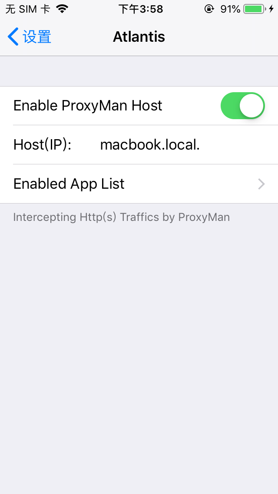
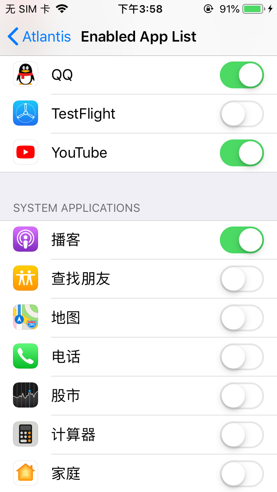
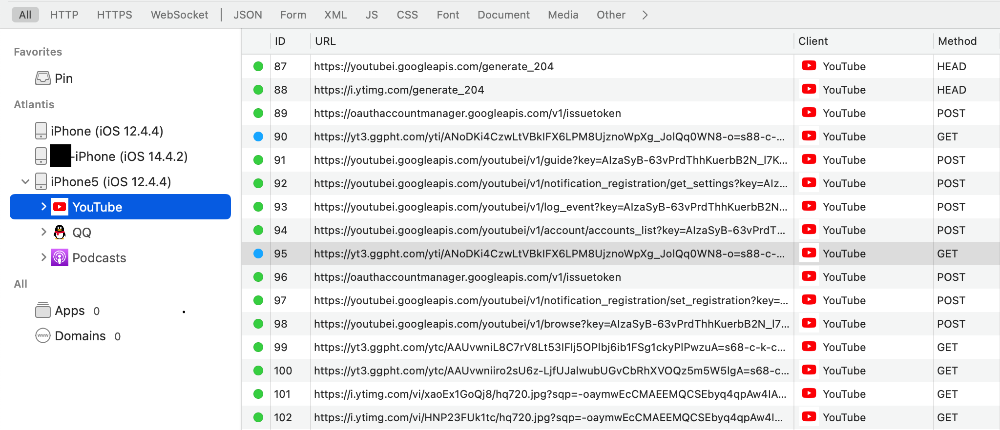

# Build and Use

```shell
### First install and setup theos
sudo git clone --recursive https://github.com/theos/theos /opt/theos
export THEOS=/opt/theos
export THEOS_DEVICE_IP=YouriPhoneIP

### Build tweak
git clone https://github.com/runatlantis/atlantis
cd atlantis/theos

make -j4
make package

#before install, make sure install applist, preferenceloader from cydia
make install

### Phone will restart SpringBoard, then Open Settings - Atlantis enable/disable app you want
### restart the target app, and you can see network traffics on Proxyman
```





